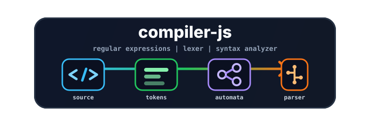

<div align="center">
  
  <h1>compiler-js</h1>
  <p><b>Motor educativo de compilación con TypeScript, autómatas finitos, lexer y parser</b></p>

  <p>
    <a href="https://www.typescriptlang.org/" target="_blank" rel="noopener noreferrer">
      
    </a>
    <a href="https://pnpm.io/" target="_blank" rel="noopener noreferrer">
      
    </a>
    <a href="https://mochajs.org/" target="_blank" rel="noopener noreferrer">
      
    </a>
    <a href="https://github.com/bcoe/c8" target="_blank" rel="noopener noreferrer">
      
    </a>
    <a href="./package.json" target="_blank" rel="noopener noreferrer">
      
    </a>
  </p>
</div>

---

**compiler-js** es un proyecto educativo escrito en TypeScript para estudiar piezas internas de un
compilador: expresiones regulares, autómatas finitos, análisis léxico, tabla de símbolos y análisis
sintáctico.

El repositorio no intenta reemplazar `RegExp` de JavaScript ni implementar un compilador completo.
Su objetivo es hacer visibles las estructuras y transformaciones que normalmente quedan ocultas en
herramientas de compilación más grandes.

## Qué incluye

- Conversión de expresiones regulares simples a AFN-e.
- Conversión de AFN-e a AFD mediante construcción por subconjuntos.
- Mapeo de AFD a una tabla de transiciones ejecutable.
- Ejecución de autómatas sobre texto con posición de coincidencia.
- Lexer configurable con tokens y tabla de símbolos.
- Parser basado en gramática y tabla de acciones.
- Pruebas unitarias con Mocha, Chai, TypeScript y c8.

## Instalación

```bash
pnpm install
```

## Scripts

| Comando             | Descripción                                         |
| ------------------- | --------------------------------------------------- |
| `pnpm build`        | Compila TypeScript en `build/`.                     |
| `pnpm test`         | Compila, ejecuta pruebas y genera cobertura con c8. |
| `pnpm watch`        | Observa cambios y vuelve a ejecutar las pruebas.    |
| `pnpm format`       | Formatea el repositorio con Prettier.               |
| `pnpm format:check` | Verifica formato sin modificar archivos.            |

## Uso rápido

### Expresiones regulares

```ts
import { RegularExpresion } from './src/regular-expresion';

const expression = new RegularExpresion('A+B*');
const result = expression.match('XXAAAB');

console.log(result.isValid); // true
console.log(result.finded); // AAAB
console.log(result.start); // 2
console.log(result.end); // 6
```

### Máquina de estados finitos

```ts
import { FiniteStateMachine } from './src/finite-state-machine/finite-state-machine';

const states = {
  '1-a': '2',
  '2-a': '2',
  '2-b': '3'
};

const fsm = new FiniteStateMachine(states, ['3']);

fsm.process('aaaaaaab', '1'); // true
```

### Análisis léxico

```ts
import { Lex } from './src/lex';

const lex = new Lex(
  {
    NUMBER: /\-?[0-9]*\.?[0-9]+/,
    '+': /\+/,
    NEW_LINE: /[\n\r]/
  },
  {
    addSymbolTable: ['NUMBER'],
    counterLines: ['NEW_LINE']
  }
);

lex.analyze('10+20');

console.log(lex.tokens);
console.log(lex.symbolTable);
```

## Flujo interno

```text
Expresión regular
    |
    v
NonDeterministic -> State (AFN-e)
    |
    v
Deterministic -> State (AFD)
    |
    v
DeterministicMapping -> tabla de transiciones
    |
    v
FiniteStateMachine -> resultado de ejecución

Código fuente -> Lex -> tokens + tabla de símbolos -> Syntax -> aceptación/rechazo
```

## Documentación

La documentación extendida está en [`docs/README.md`](docs/README.md):

- [`docs/arquitectura-y-procesos.md`](docs/arquitectura-y-procesos.md): componentes, flujos y
  limitaciones.
- [`docs/clases.md`](docs/clases.md): referencia de clases, métodos y estructuras.
- [`docs/desarrollo.md`](docs/desarrollo.md): instalación, scripts, pruebas y convenciones.

## Estado actual

El proyecto soporta un subconjunto deliberadamente pequeño de expresiones regulares: concatenación,
unión (`|`), Kleene (`*`), uno o más (`+`) y agrupación con paréntesis. No hay punto de entrada
público que reexporte toda la API; por ahora los ejemplos importan directamente desde `src/`.
